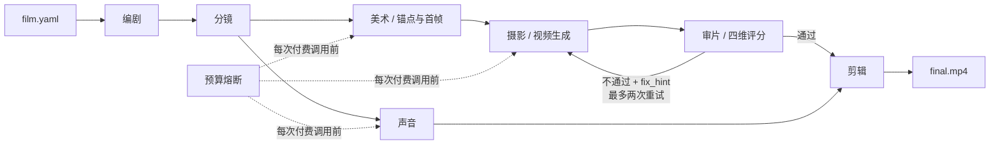

# LUMEN

> 一个人的 AI 电影剧组。把电影写成可校验、可审查、可恢复的 `film.yaml`，再由八个角色 Agent 协作生产。

LUMEN 的首部作品是 100 秒科幻短片《消失的光芒》（95 秒镜头 + 5 秒片尾）。项目的核心不是“调用一次视频模型”，而是三个工程闭环：视觉锚点保持一致性、VLM 审片后带理由重拍、预算到顶立即熔断。

## 工作流



八个角色分别是制片（`orchestrator.py`）、编剧、分镜、美术、摄影、声音、剪辑和审片。所有角色通过 [Pydantic 契约](lumen/contracts.py) 通信，不传裸字典；所有调用写入经过密钥脱敏的 `run.jsonl`。

## 已固化的作品契约

[film.yaml](projects/vanishing-light/film.yaml) 包含：

- 完整 14 镜分镜，镜头总长精确 95 秒；
- E-06、灯塔与 A/B/HANDS/EVOLVED_EYES 四组机器可读锚点；
- 总分 `>= 7.0` 且每一维 `>= 6.0` 的质量门；
- 主模型、稳定降级、低成本降级三段视频路线；
- ¥300 硬上限与按模型、分辨率配置的原价估算；
- 两句最终对白，避免文档中“2 句/4 句”的口径冲突。

## 快速开始

要求：Python 3.11+；真实剪辑与审片抽帧还需要 `ffmpeg`/`ffprobe`。

```bash
cd /Users/king/lumen
uv venv --python 3.12
uv pip install --python .venv/bin/python -e '.[dev,studio]'

# 严格校验 14 镜、引用和时长
.venv/bin/lumen validate projects/vanishing-light/film.yaml

# 零网络、零密钥、零费用：打印完整 DAG 与最坏成本
.venv/bin/lumen run projects/vanishing-light/film.yaml --dry-run

# 从已冻结的 film.yaml 生成 script.json / shots.json
.venv/bin/lumen run projects/vanishing-light/film.yaml --mode offline

# 测试
.venv/bin/pytest
```

`--dry-run` 不实例化 Provider、不读取 API Key、不写运行状态。它按官方原价展示首次生成和“首次 + 最多两次重拍”的最坏成本；任何折扣只有在控制台确认后才能显式写入配置。

## 真实 Provider

复制环境变量模板并只填写**刚刚轮换的新凭据**：

```bash
cp .env.example .env
```

不要把密钥粘贴到聊天、截图、Git 命令、远程 URL 或日志中。`.env` 已被 Git 忽略；Provider 也支持 Studio 的请求级 BYOK 注入，不会把访客密钥写入 `os.environ`。

当前视频能力矩阵：

| 路线 | 参考图字段 | 特殊参数 | 用途 |
|---|---|---|---|
| `wan3.0-video` | `input.media[]` | 支持 `ratio`；可能需要邀测权限 | 主路线 |
| `wan2.7-i2v-2026-04-25` | `input.media[]` | 比例跟随首帧，不发送 `ratio` | 稳定降级 |
| `wan2.6-i2v-flash` | `input.img_url` | `audio=false` 低成本档 | 试拍/低成本降级 |

TTS 默认使用支持系统音色的 `cosyvoice-v3-flash`。`cosyvoice-v3.5-plus/flash` 只支持
复刻或设计音色，只有在项目已经创建并批准对应音色 ID 时才应切换。

真实付费运行必须分阶段进行。项目不会在没有以下证据时自动批量烧额度：

1. E-06 角色锚点由创作者明确批准；
2. 三镜低成本试拍完成，并记录 D9 `GO` 或切换到背影/剪影 Plan B；
3. 控制台确认模型权限、北京地域、额度与当日实际价格。

分阶段命令（所有付费阶段都必须显式确认）：

```bash
FILM=projects/vanishing-light/film.yaml

# 已提供四张 v1 候选图；人工选定后，把 film.yaml 对应 approved 改为 true。
# 如需通过 DashScope 另生成候选图：
.venv/bin/lumen produce "$FILM" --stage anchors --confirm-spend

# 生成 14 张首帧；先只试拍一镜，再决定是否批量生成。
.venv/bin/lumen produce "$FILM" --stage keyframes --confirm-spend
.venv/bin/lumen produce "$FILM" --stage shot --shot S03 --confirm-spend

# D9 通过后：复制 GO_NO_GO.example.json 为 GO_NO_GO.json 并填写决策证据。
.venv/bin/lumen produce "$FILM" --stage shots --confirm-spend

# 两句对白使用不同的已启用系统音色；最后混流成严格 100 秒母版。
.venv/bin/lumen produce "$FILM" --stage audio --confirm-spend
.venv/bin/lumen produce "$FILM" --stage render
```

`render` 要求 14 条通过审片的最终视频和两条对白音频均已存在；输出为
`projects/vanishing-light/06_cut/generated/final.mp4`。任何一项缺失都会明确停止，
不会交付残缺母版。

## 审片闭环

审片 Agent 从每条视频均匀抽取三帧，对照导演意图和锚点描述，在四个维度打分：

1. 角色一致性；
2. 构图符合分镜；
3. 光线氛围；
4. 无明显崩坏。

程序自行重算通过条件，不相信模型返回的 `passed`。不通过时，`critique` 和可执行的 `fix_hint` 会前置回灌给下一次生成；三次仍失败即停止，并标记 `needs_human_review`。

## Studio

`studio/app.py` 提供两个 Tab：

- 演示模式：默认零成本，展示 `film.yaml`、中间产物、运行账单和重拍证据；素材不存在时给出明确状态，不崩溃。
- 实跑模式：访客自带密钥、按请求隔离；先动态展示最坏成本并要求确认，单次只允许一个短镜头。

实跑模式的“预检”只检查本地模型能力矩阵、参考图、时长与 ffmpeg，不会联网验证密钥；
只有用户勾选付费确认并点击生成后，才会发起一次视频请求和一次审片请求。请求结束后即清空内存中的凭据。

本地运行：

```bash
.venv/bin/python studio/app.py
```

## 目录

```text
.qoder/                    Qoder rules、专家 Agent 与可审查架构文档
lumen/
  agents/                  编剧、分镜、美术、摄影、声音、剪辑、审片
  providers/               ModelScope / DashScope / Fake Provider
  contracts.py             全系统严格数据契约
  orchestrator.py          DAG、成本预演和断点续跑
  budget.py                预算硬熔断
  runlog.py                JSONL 追溯与密钥脱敏
projects/vanishing-light/  电影源代码与阶段产物
studio/                    魔搭创空间 Gradio 应用
tests/                     离线单元与集成测试
```

## 可复现性的定义

生成式模型无法保证像素级重现。LUMEN 所说的“可复现”是：配置、提示词、锚点、模型版本、尝试次数、费用、审片意见、输入/输出哈希与状态都可追踪，并能从任一失败节点继续运行。

## 官方资料

- [ModelScope API-Inference](https://modelscope.cn/docs/model-service/API-Inference/intro)
- [ModelScope 免费额度与限流](https://modelscope.cn/docs/model-service/API-Inference/limits)
- [Wan 3.0 视频 API](https://help.aliyun.com/zh/model-studio/wan3-video-generation-api-reference)
- [Wan 2.7 图生视频 API](https://help.aliyun.com/zh/model-studio/image-to-video-general-api-reference)
- [Wan 2.1–2.6 图生视频 API](https://help.aliyun.com/zh/model-studio/legacy-image-to-video-api-reference/)
- [DashScope 异步任务](https://help.aliyun.com/en/model-studio/manage-asynchronous-tasks)
- [模型价格](https://help.aliyun.com/zh/model-studio/model-pricing)

## 安全与项目状态

任何曾经公开出现在聊天或截图中的 GitHub、ModelScope、DashScope 凭据都必须撤销，不能继续使用。仓库内只允许占位符和环境变量名。

代码系统可以离线完成并验证；真实锚点选择、付费生成、成片发布、魔搭创空间上线、B 站上传和比赛表单提交仍属于需要创作者账号确认的人工门禁。
